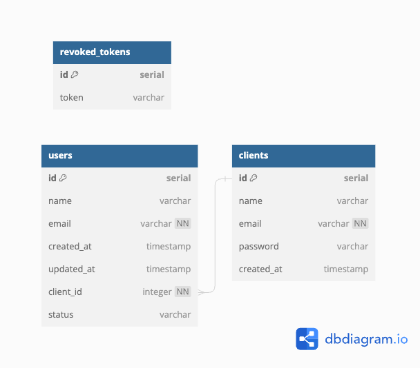
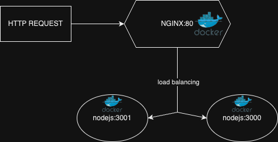

# Template TypeScript Node.js Backend with Postgres Database

This repository serves as a template for creating a TypeScript-based Node.js backend with a Postgres database. It includes configurations for various tools and technologies to help you get started quickly with building a robust backend for your projects.

Here's the Database diagram :


## Table of Contents

- [Description](#description)
- [Getting Started](#getting-started)
  - [Prerequisites](#prerequisites)
  - [Installation](#installation)
- [RUN in local with docker-compose up](#run-in-local-with-docker-compose-up)
- [Project Structure](#project-structure)
- [Scripts](#scripts)
- [Dependencies](#dependencies)
- [Environment Variables](#environment-variables)
- [License](#license)

## Description

This template provides a solid foundation for a TypeScript-based Node.js backend integrated with a Postgres database. It includes configurations for ESLint, Husky, Prettier, and Swagger to ensure code quality, formatting, and documentation consistency. Additionally, it comes with Jest for testing, Flyway for database migrations, and Docker Compose for easy deployment.

## Getting Started

### Prerequisites

Before you begin, make sure you have the following installed on your system:

- [Node.js](https://nodejs.org) (version 14 or later)
- [Postgres](https://www.postgresql.org/)
- [Docker](https://www.docker.com/)
- [Postman](https://www.postman.com/downloads/)

### Installation

1. Clone the repository:

```bash
git clone https://github.com/pierrot498/template-nodejs-typescript-postgres.git
cd template-nodejs-typescript-postgres
```

2. Install the dependencies:

```bash
npm install
```

3. Set up the environment variables:

Copy the `.env.example.local` file and rename it to `.env.local`. Then, fill in the required environment variables:

```
LOG_DIR="../logs"
DB_HOST=your_database_host
DB_PORT=your_database_port
DB_USER=your_database_username
DB_PASSWORD=your_database_password
DB_DATABASE=your_database_name
SECRET=your_secret
```

Make sure to replace `your_database_host`, `your_database_port`, `your_database_username`, `your_database_password`, and `your_database_name` with the appropriate values.

## RUN in local with docker-compose up

1. Navigate to the project directory:

```bash
cd template-nodejs-typescript-postgres
```

2. Start the application using `docker-compose`:

```bash
docker-compose up
```

This will set up the necessary containers and run the project locally.

## Usage

To interact with the API, you can use Postman with the correct "local" environment:

1. Import the "local" environment under `./postman/environment/local.postman_environment.json` file into Postman. The environment file should contain variables like `BASE_URL`, `JWT_TOKEN`, etc.

2. Import collection called `Postman template collection.postman_collection.json`

3. Call POST `/signup` to sign up as a new client using the provided endpoint.

4. Once signed up, obtain the JWT token from the response of the `/login` endpoint to get a JWT token.

5. Set the obtained JWT token as the value of the `JWT_TOKEN` variable in the Postman environment.

6. Now, you can perform API requests with the authenticated client and create users related to that particular client.

## Project Structure

The project structure is organized as follows:

- `config`: Contains configuration files for various tools (ESLint, Prettier, etc.).
- `exceptions`: Holds custom exception classes for error handling.
- `interfaces`: Includes TypeScript interfaces for data structures.
- `main/resources/db/migrations`: Stores Flyway database migration scripts.
- `middlewares`: Contains custom middleware functions.
- `routes`: Defines Express routes for different API endpoints.
- `schemas`: Includes JSON schemas for validating request and response data.
- `services`: Contains business logic and interaction with the database.
- `tests/endpoints`: Houses integration tests for API endpoints.

## Scripts

- `npm start`: Builds the project and starts the server.
- `npm run dev`: Builds the project and starts the server in development mode using Nodemon.
- `npm run build`: Compiles the TypeScript code using SWC and generates the `dist` folder.
- `npm run lint`: Lints the TypeScript code using ESLint.
- `npm run lint:fix`: Fixes linting errors automatically.
- `npm test`: Runs Jest tests with coverage and various options.
- `npm run unit:test`: Runs Jest unit tests and generates coverage reports.

## Dependencies

The project utilizes several dependencies, including Express, Postgres, Jest, Axios, and others. You can find the complete list of dependencies and devDependencies in the `package.json` file.

## Environment Variables

The project requires specific environment variables for configuration. Refer to the [Installation](#installation) section for details on setting up the `.env.local` file.

## Docker compose with nginx as load balancer for 2 servers

Here's the nginx load balancer diagram :



- We have created a new service named `nginx`, which will act as the load balancer.
- The Nginx configuration file `nginx.conf` is assumed to be present in the `./nginx` directory. It is mounted into the Nginx container at the path `/etc/nginx/nginx.conf`. The configuration in `nginx.conf` should include the load balancer settings, directing requests to the two `api` services (`api` and `api2`).
- The `depends_on` section for the `nginx` service ensures that the load balancer starts after the `api` and `api2` services are up and running.

Please ensure you have the appropriate Nginx configuration (`nginx.conf`) in the `./nginx` directory before running the `docker-compose` file. The `nginx.conf` file should contain the necessary load balancing settings for Nginx to distribute incoming requests between the `api` and `api2` services.

## License

This project is licensed under the ISC License. See the [LICENSE](LICENSE) file for details.

Feel free to use this template as a starting point for your Node.js projects. Happy coding! 🚀
